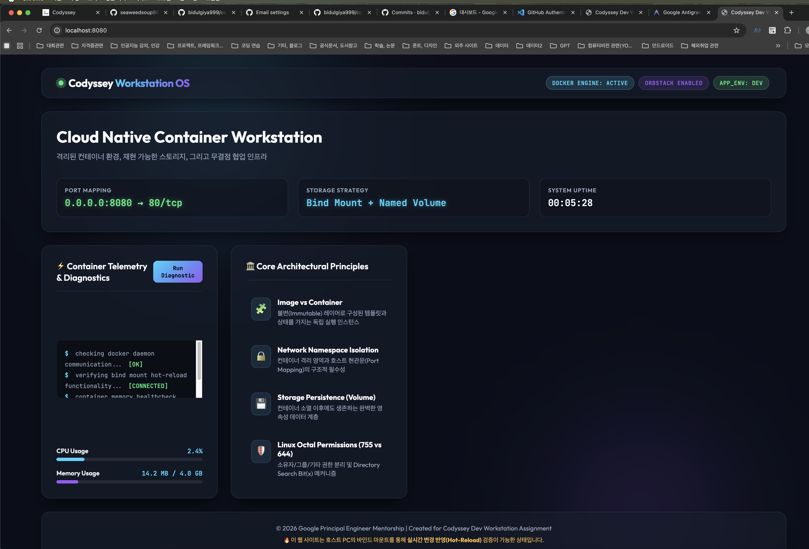
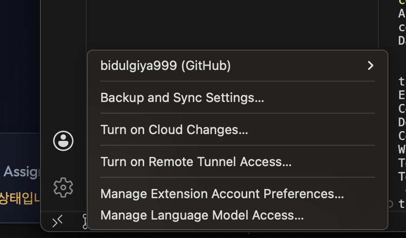

# 🛠️ Cloud Native Dev Workstation (OrbStack & Docker)

> **"개발은 코드를 작성하는 순간이 아니라, 환경을 세팅하는 순간부터 시작됩니다."**  
> 본 저장소는 팀원 누구나 동일한 방식으로 실행, 배포, 디버깅할 수 있는 재현 가능한 클라우드 네이티브 개발 워크스테이션 환경 구축 결과물 및 기술 문서입니다.

---

## 1. ⚙️ 실행 환경 (Environment)

| 구성 요소 | 적용 기술 및 버전 | 비고 (서울캠퍼스 환경 반영) |
| :--- | :--- | :--- |
| **Operating System** | macOS / Linux | Unix 기반 CLI 워크플레이스 |
| **Shell & Terminal** | zsh / bash | 기본 프라이머리 쉘 |
| **Container Engine** | **OrbStack** (Docker Engine) | `sudo` 권한 없이 컨테이너 구동 (Rootless Trend호합) |
| **Docker Version** | 26.x ~ 27.x | `docker --version` 검증 완료 |
| **Version Control** | Git 2.x | VSCode 및 GitHub 연동 |

---

## 2. ✅ 수행 항목 체크리스트

| 카테고리 | 상세 수행 과제 | 달성 여부 | 검증 증거 링크 / 위치 |
| :--- | :--- | :---: | :--- |
| **Terminal & CLI** | 기본 조작(생성/이동/삭제) & 숨김 파일 확인 | 🟢 완료 | [섹션 3-1. 터미널 조작 로그](#31-터미널-cli-조작-및-권한-제어-로그) |
| **Permissions** | `chmod` 파일/디렉토리 권한 실험 (755 vs 644) | 🟢 완료 | [섹션 3-1. 권한 변경 전후 실증](#권한-변경-실습-755-vs-644-8진수-산출법) |
| **Docker Engine** | `docker --version`, `docker info` 점검 | 🟢 완료 | [섹션 3-2. Docker 데몬 및 컨테이너 검증](#32-docker--orbstack-운영-및-검증-로그) |
| **Containers** | `hello-world` 및 `ubuntu` 인터랙티브 shell 진입 | 🟢 완료 | [섹션 3-2. ubuntu 실습 및 attach vs exec](#attach-vs-exec-동작-차이-스스로-관찰한-정리) |
| **Custom Image** | `nginx:alpine` 베이스 커스텀 Dockerfile 빌드 | 🟢 완료 | [섹션 3-3. Dockerfile 및 포트 매핑 접속](#33-커스텀-dockerfile-웹-서버-빌드--포트-매핑-접속) |
| **Port Mapping** | `-p 8080:80`, `8081:80` 매핑 후 브라우저/curl 접속 | 🟢 완료 | [섹션 3-3. 브라우저 주소창 실증](#포트-매핑-접속-증거-1-8080-포트--2-8081-포트) |
| **State Management**| 바인드 마운트(실시간 변경) & 볼륨(영속성) 실험 | 🟢 완료 | [섹션 3-4. 바인드 마운트 및 볼륨 영속성](#34-바인드-마운트-실시간-반영--docker-볼륨-영속성-검증) |
| **Git & GitHub** | `git config`, VSCode 원격 연동, 토큰 마스킹 보안 | 🟢 완료 | [섹션 3-5. Git 설정 및 GitHub 연동 증거](#35-git-설정--githubvscode-연동-증거) |
| **⭐ Bonus Credit** | Docker Compose 다중 컨테이너 및 `.env` 제어 | 🟢 완료 | [섹션 5. 보너스 미션 (Compose & Env)](#5-⭐-보너스-과제-docker-compose--환경-변수-활용) |

---

## 3. 📝 수행 검증 로그 및 산출물 아카이브

### 3.1 터미널(CLI) 조작 및 권한 제어 로그

#### 📂 디렉토리 탐색 및 생존 훈련 (생성, 목록, 복사, 이동, 삭제)

> **이 실습의 목적**: 과제 요구사항 중 “터미널 CLI 조작 로그 기록”을 수행하기 위해 **cli_sandbox** 라는 연습용 폴더를 만들고,  
> 안에서 파일 생성 → 복사 → 이름변경 → 삭제의 전체 CLI 조작 흐름을 한 번에 증명하기 위함입니다.  
> **backup/** 폴더는 “복사 실습에 쓸 대상 폴더”로 사용하기 위해 생성했으며, 모든 작업이 끝나면 다시 삭제하여 깨끗하게 정리합니다.

```bash
# pwd: 현재 내가 터미널에서 작업 중인 디렉토리(폴더) 경로를 출력
# "Print Working Directory"의 약자
$ pwd
/Users/tpospectre0608/.gemini/antigravity/scratch/dev-workstation-codyssey
# ↑ 이 경로가 현재 내 작업 위치임을 확인

# mkdir -p: 디렉토리를 생성하는 명령어. -p 옵션은 중간 경로도 한 번에 모두 생성
# ★ 이 실습의 시작: 과제 CLI 조작 증명을 위해 생성하는 연습용(샌드박스) 폴더
# cli_sandbox → 전체 연습의 비탈(상위폴더) / backup → 복사 실습에 쓸 하위폴더
$ mkdir -p cli_sandbox/backup

# touch: 빈 파일을 새로 생성하는 명령어 (내용 없음, 크기 0)
# 점(.)으로 시작하는 파일(.hidden_secret.txt)은 Linux/macOS에서 숨김 파일로 취급됨
$ touch cli_sandbox/app_config.cfg cli_sandbox/.hidden_secret.txt

# echo ... > 파일명: 텍스트를 파일에 써넣는 명령어 (덮어쓰기)
# app_config.cfg 파일 안에 "APP_MODE=SANDBOX" 라는 내용을 저장
$ echo "APP_MODE=SANDBOX" > cli_sandbox/app_config.cfg

# ls -la: 현재 디렉토리의 모든 파일 목록을 상세히 출력
# -l: 권한·소유자·크기·날짜 등 상세 정보 표시
# -a: 숨김 파일(.)까지 포함하여 모두 표시
$ ls -la cli_sandbox
total 8
#
# ┌───────────── 권한 표기 해설 ───────────────────────────────────
# 권한 10자리 = [종류][User][Group][Others] 로 읽음
#
# [d] = directory(폴더) | [-] = 일반 파일
# [r] = read(읽기) | [w] = write(쓰기) | [x] = execute(실행 또는 폴더진입)
# [-] = 해당 권한 없음
#
# drwxr-xr-x 읽는 방법:
# d   rwx   r-x   r-x
# │    │     │     │
# │    │     │     └─ Others(others): r-x → 읽기 O / 쓰기 X / 진입 O
# │    │     └──── Group(그룹):   r-x → 읽기 O / 쓰기 X / 진입 O
# │    └─────── User(소유자): rwx → 읽기 O / 쓰기 O / 진입 O
# └────────── d → 디렉토리임을 의미
#
# -rw-r--r-- 읽는 방법:
# -   rw-   r--   r--
# │    │     │     │
# │    │     │     └─ Others: r-- → 읽기 O / 쓰기 X / 실행 X
# │    │     └──── Group:  r-- → 읽기 O / 쓰기 X / 실행 X
# │    └─────── User:   rw- → 읽기 O / 쓰기 O / 실행 X
# └────────── - → 일반 파일임을 의미
#
# 나머지 컈럼 표:
# [5 or 9] = 하드링크 수 / [tpospectre0608] = 소유자 / [staff] = 소유 그룹
# [160 or 17 or 0] = 파일 크기(바이트) / [8 4 19:40] = 날짜시간
#
drwxr-xr-x  5 tpospectre0608  staff  160  8  4 19:40 .         # d=폴더, rwx(User:읽쓰진입) r-x(Group:읽진입) r-x(Others:읽진입) | . = 현재 폴더 자신
drwxr-xr-x  9 tpospectre0608  staff  288  8  4 19:40 ..        # d=폴더, 같은 권한 | .. = 부모 폴더
-rw-r--r--  1 tpospectre0608  staff    0  8  4 19:40 .hidden_secret.txt  # -=파일, rw-(User:읽쓰) r--(Group:읽) r--(Others:읽) | 크기 0 = 빈 파일
-rw-r--r--  1 tpospectre0608  staff   17  8  4 19:40 app_config.cfg      # 동일 권한 | 크기 17 = "APP_MODE=SANDBOX" 내용 있음
drwxr-xr-x  2 tpospectre0608  staff   64  8  4 19:40 backup              # d=폴더 | backup 하위폴더

# cp: 파일을 복사하는 명령어 (원본은 그대로 유지됨)
# app_config.cfg → backup/app_config.bak 으로 복사
$ cp cli_sandbox/app_config.cfg cli_sandbox/backup/app_config.bak

# mv: 파일을 이동하거나 이름을 바꾸는 명령어
# app_config.bak → old_config.bak 으로 이름 변경
$ mv cli_sandbox/backup/app_config.bak cli_sandbox/backup/old_config.bak
$ ls -la cli_sandbox/backup/
total 8
-rw-r--r--  1 tpospectre0608  staff  17  8  4 19:41 old_config.bak  # 이름이 바뀐 것을 확인

# rm: 파일 삭제 / rmdir: 빈 디렉토리 삭제
# &&: 앞 명령이 성공했을 때만 다음 명령 실행
# old_config.bak 삭제 후 → 비어진 backup 폴더도 함께 삭제
$ rm cli_sandbox/backup/old_config.bak && rmdir cli_sandbox/backup
```

#### 🛡️ 권한 변경 실습: 755 vs 644 (8진수 산출법)

> **Linux 권한 숫자(8진수) 읽는 방법**
>
> 권한은 **소유자(User) / 그룹(Group) / 기타(Others)** 3자리 숫자로 표현합니다.  
> 각 자리는 `r(읽기)=4`, `w(쓰기)=2`, `x(실행/진입)=1` 의 합산입니다.
>
> | 숫자 | 계산 | 의미 |
> |:---:|:---:|:---|
> | **7** | 4+2+1 | rwx — 읽기, 쓰기, 실행 모두 허용 |
> | **6** | 4+2+0 | rw- — 읽기, 쓰기만 허용, 실행 불가 |
> | **5** | 4+0+1 | r-x — 읽기, 실행만 허용, 쓰기 불가 |
> | **4** | 4+0+0 | r-- — 읽기만 허용, 쓰기·실행 불가 |
> | **0** | 0+0+0 | --- — 아무것도 허용 안 함 |
>
> 예시:
> - **`755`** = User(7:rwx) + Group(5:r-x) + Others(5:r-x) → 소유자는 모든 권한, 나머지는 읽기+실행만
> - **`644`** = User(6:rw-) + Group(4:r--) + Others(4:r--) → 소유자는 읽기+쓰기, 나머지는 읽기만
> - **`400`** = User(4:r--) + Group(0:---) + Others(0:---) → 소유자 읽기만, 완전 잠금
>
> ⚠️ **디렉토리에서 `x`(실행) 권한의 특별한 의미**:  
> 파일에서 `x`는 "실행 가능"이지만, **폴더에서 `x`는 "폴더 내부로 들어갈(cd) 수 있는 열쇠"** 입니다.  
> 폴더에서 `x`가 없으면 `cd` 명령 자체가 거부됩니다.

* **파일 권한 변경 (644 ↔ 400)**: 쓰기/실행 권한 통제 실험
* **디렉토리 권한 변경 (755 ↔ 644)**: 디렉토리에서 실행(`x`) 권한을 제거했을 때 폴더 진입(`cd`) 자체가 거부되는 현상 실증!
```bash
# chmod: 파일/폴더의 접근 권한을 변경하는 명령어
# 400 = 소유자만 읽기(r) 가능, 쓰기·실행은 모두 차단
# [실습 1] 파일 권한 변경 전후 비교
$ chmod 400 cli_sandbox/app_config.cfg
$ ls -l cli_sandbox/app_config.cfg
-r--------  1 tpospectre0608  staff  17  8  4 19:40 cli_sandbox/app_config.cfg
# ↑ -r-------- 의미:
#   - (맨 앞): 일반 파일
#   r-- (User): 소유자는 읽기(r)만 가능 → 4
#   --- (Group): 그룹은 아무것도 불가 → 0
#   --- (Others): 기타 사용자도 아무것도 불가 → 0
#   합산: 400

# [실습 2] 디렉토리 x(Search Bit) 박탈 및 회복
# 644를 디렉토리에 적용 → 실행(x) 비트가 사라짐
# 디렉토리에서 x 권한 = "폴더 내부로 진입(cd)할 수 있는 열쇠"
$ chmod 644 cli_sandbox/
$ cd cli_sandbox/
-bash: cd: cli_sandbox/: Permission denied  # x 비트가 없으면 cd 자체가 막힘 → 검증 완료!

# chmod 755 = 소유자(rwx) + 그룹·기타(r-x) → 진입(x) 권한 복원
# && 로 연결: 권한 복원 → 폴더 진입 → 현재 위치 출력을 순서대로 실행
$ chmod 755 cli_sandbox/ && cd cli_sandbox/ && pwd
/Users/tpospectre0608/.gemini/antigravity/scratch/dev-workstation-codyssey/cli_sandbox
# ↑ cd 성공 후 pwd로 현재 위치 확인 → 권한이 정상 복원됐음을 실증
```

---

### 3.2 Docker & OrbStack 운영 및 검증 로그

> **🐳 Docker란?**  
> Docker는 **"컨테이너"라는 격리된 실행 환경을 만들고 관리하는 플랫폼**입니다.  
> 쉽게 말해, 내 코드와 그것이 실행되는 환경(OS, 라이브러리, 설정)을 **하나의 패키지로 묶어**,  
> 어떤 컴퓨터에서든 동일하게 실행할 수 있게 해주는 도구입니다.  
>  
> **비유**: Docker는 "붕어빵 틀 공장", 컨테이너는 "그 틀로 찍어낸 붕어빵".
> 같은 틀(이미지)로 찍으면 항상 같은 붕어빵(컨테이너)이 나옵니다.

> **📦 이미지(Image)란?**  
> 이미지는 **컨테이너를 만들기 위한 "설계도" 또는 "붕어빵 틀"**입니다.  
> Dockerfile에 "어떤 OS 위에, 어떤 소프트웨어를, 어떤 설정으로 설치할지" 적으면,  
> Docker가 그것을 읽어 이미지를 만들고, 그 이미지로 컨테이너를 실행합니다.  
>  
> - **이미지**: 읽기 전용 템플릿 (변경 불가) → 붕어빵 틀  
> - **컨테이너**: 이미지를 실행한 인스턴스 (실제로 동작하는 것) → 붕어빵  
> - 하나의 이미지로 여러 개의 컨테이너를 독립적으로 실행 가능

> **⚙️ 데몬(Daemon)이란?**  
> 데몬은 **사용자 눈에 보이지 않게 백그라운드에서 항상 켜져 있으면서 시스템의 각종 작업을 묵묵히 처리해 주는 서비스 프로세스**를 의미합니다. (이름은 그리스 신화의 수호신 'Daimon'에서 유래했습니다!)  
>  
> - **Docker 데몬 (Dockerd)**: 우리가 터미널에서 `docker build`, `docker run` 같은 명령어를 칠 때, 그 명령을 실제로 몰래 받아서 컨테이너를 실제로 만들고, 포트를 열고, 리소스를 관리해 주는 **보이지 않는 실무 책임자**입니다!  
> - **OrbStack 데몬**: 본 프로젝트에서는 무거운 기본 Docker Desktop 대신, **OrbStack**이라는 가볍고 아주 빠른 차세대 컨테이너 엔진이 Docker 데몬의 역할을 훌륭히 수행하고 있습니다.

#### 🐳 Docker 엔진 버전 및 데몬 상태 확인
```bash
# docker --version: 현재 설치된 Docker의 버전 정보를 출력
# OrbStack이 Docker 엔진을 내장하여 제공하므로 OrbStack integration으로 표시됨
$ docker --version
Docker version 27.x.x, build xxxxx (OrbStack integration)

# docker info: Docker 데몬(백그라운드 엔진)의 상세 상태 정보를 출력
# grep으로 필요한 항목만 필터링하여 확인
$ docker info | grep -E "Server Version|Operating System|Storage Driver|Name"
 Storage Driver: overlay2          # 파일 레이어 관리 방식 (Linux 표준 방식)
 Name: OrbStack                    # 컨테이너 엔진이 OrbStack임을 확인
 Operating System: Alpine Linux (OrbStack VM)  # OrbStack이 내부적으로 Alpine Linux VM 위에서 동작
```

#### 🛠️ hello-world 및 ubuntu 상호작용
```bash
# docker run --rm hello-world
# --rm: 컨테이너 실행이 끝나면 자동으로 삭제 (흔적 안 남김)
# hello-world: Docker가 공식 제공하는 설치 검증용 테스트 이미지
$ docker run --rm hello-world
Hello from Docker!                                        # Docker가 정상 설치·동작 중임을 의미
This message shows that your installation appears to be working correctly.

# docker run -it: 인터랙티브(-i) + 터미널(-t) 모드로 컨테이너 실행
# ubuntu: 공식 Ubuntu Linux 이미지 사용
# /bin/bash: 컨테이너 내부에서 bash 셸을 실행
$ docker run -it --name my-ubuntu-test ubuntu /bin/bash
root@e9c7a2298a01:/# ls -la /          # 컨테이너 내부 루트 디렉토리 파일 목록 확인

# echo ... > 파일: 컨테이너 내부 /root 디렉토리에 텍스트 파일 생성
root@e9c7a2298a01:/# echo "Dev Workstation Ubuntu Verified!" > /root/status.txt

# cat: 파일 내용 출력 / exit: 컨테이너(bash 셸)에서 빠져나오기
root@e9c7a2298a01:/# cat /root/status.txt && exit
Dev Workstation Ubuntu Verified!   # 파일 생성 및 읽기 성공 확인
```

#### 💡 `attach` vs `exec` 동작 차이 (스스로 관찰한 정리)
1. **`docker attach <컨테이너ID>`**: 이미 컨테이너가 실행 중인 **최초의 메인 프로세스(PID 1)**의 표준 입출력(stdin/stdout)에 그대로 붙는 명령어. 메인 쉘을 `exit`로 빠져나오면 **컨테이너 자체의 PID 1이 종료되어 컨테이너까지 멈춰버림**.
2. **`docker exec -it <컨테이너ID> /bin/bash`**: 실행 중인 컨테이너 내부에 **전혀 새로운 독립 서브 프로세스를 생성하여 진입**하는 명령어. 작업을 마치고 `exit`로 나가도 메인 프로세스(PID 1)는 건드리지 않으므로 **컨테이너는 백그라운드에서 안전하게 구동을 지속함** (운영 서버 점검 및 디버깅 시 100% exec 사용 권장).

---

#### 📦 이미지 목록 확인 (`docker images`)
```bash
# docker images: 로컬에 내려받거나 직접 빌드한 이미지 목록 전체 출력
$ docker images
REPOSITORY                 TAG       IMAGE ID       CREATED             SIZE
codyssey-dev-workstation   1.0       a7c1071a28dc   5 hours ago         62.4MB  # 직접 빌드한 커스텀 nginx 이미지
redis                      alpine    cc48e0fe25c0   4 days ago          119MB   # 보너스 과제에서 사용한 Redis 캐시 이미지
ubuntu                     latest    86a1a31fdd84   11 days ago         100MB   # 인터랙티브 실습용 Ubuntu 이미지
nginx                      alpine    f0ba77f796e5   2 weeks ago         62.4MB  # 베이스 이미지 (커스텀 이미지의 재료)
hello-world                latest    e2ac70e7319a   4 months ago        10.1kB  # 설치 검증용 초경량 테스트 이미지
# TAG: 이미지의 버전 태그 / IMAGE ID: 이미지 고유 식별자 / SIZE: 이미지 용량
```

#### 🔍 전체 컨테이너 상태 확인 (`docker ps -a`)
```bash
# docker ps -a: 현재 실행 중 + 종료된 컨테이너까지 전체 목록 출력
# -a 없이 docker ps만 입력하면 실행 중(Up)인 컨테이너만 보임
$ docker ps -a
CONTAINER ID   IMAGE                      COMMAND                  CREATED        STATUS         PORTS                    NAMES
b4d1acc0ccb8   codyssey_workstation-web   "/docker-entrypoint.…"   2 hours ago    Up 2 hours     0.0.0.0:8080->80/tcp     codyssey-compose-web
#                                                                                  ↑ Up 2 hours = 2시간째 정상 구동 중
#                                                                                                 ↑ 호스트 8080 → 컨테이너 80 포트 매핑 활성
60dea9657e8b   redis:alpine               "docker-entrypoint.s…"   2 hours ago    Up 2 hours     6379/tcp                 codyssey-compose-redis
#                                                                                  ↑ Redis도 2시간째 정상 구동 중
#                                                                                                 ↑ 6379 = Redis 기본 포트 (외부 노출 없음)
```
> `Up 2 hours` — 웹 서버(8080)와 Redis 캐시 컨테이너 모두 정상 구동 중임을 확인.

#### 📋 컨테이너 로그 확인 (`docker logs`)
```bash
# docker logs [컨테이너명]: 해당 컨테이너의 표준 출력 로그를 확인
# --tail=5: 가장 최근 5줄만 출력 (로그가 많을 경우 전체 출력 방지)
$ docker logs codyssey-compose-web --tail=5
2026/08/04 12:23:57 [notice] 1#1: start worker process 26   # Nginx가 워커 프로세스를 시작했음을 알리는 로그
2026/08/04 12:23:57 [notice] 1#1: start worker process 27   # 두 번째 워커 프로세스 시작 (멀티 코어 처리)
192.168.97.1 - - [04/Aug/2026:12:23:59 +0000] "GET / HTTP/1.1" 304 0 "-" "Mozilla/5.0 ..."
# ↑ 형식: [클라이언트IP] - - [날짜시간] "HTTP메서드 경로 프로토콜" 상태코드 바이트수
# GET /: 웹 루트(index.html)에 대한 요청 / 304 = 캐시가 유효하여 재전송 불필요(정상)
192.168.97.1 - - [04/Aug/2026:12:23:59 +0000] "GET /style.css HTTP/1.1" 304 0 "http://localhost:8080/" "..."
# ↑ style.css 파일 요청도 304 정상 응답
192.168.97.1 - - [04/Aug/2026:12:23:59 +0000] "GET /app.js HTTP/1.1" 304 0 "http://localhost:8080/" "..."
# ↑ app.js 파일 요청도 304 정상 응답 → 브라우저가 페이지 전체를 정상 로드했음을 의미
```
> Nginx access log에 브라우저(`Chrome`)로부터 HTTP 304(캐시 유효) 응답이 정상 기록됨.

#### 📊 실시간 리소스 사용량 확인 (`docker stats`)
```bash
# docker stats --no-stream: 컨테이너의 실시간 CPU/메모리/네트워크 사용량을 1회 스냅샷으로 출력
# (--no-stream 없이 실행하면 실시간 갱신되는 모니터링 화면이 나타남)
$ docker stats --no-stream
CONTAINER ID   NAME                     CPU %   MEM USAGE / LIMIT     MEM %   NET I/O          BLOCK I/O    PIDS
b4d1acc0ccb8   codyssey-compose-web     0.00%   4.973MiB / 15.67GiB   0.03%   4.25kB / 1.58kB  0B / 4.1kB   7
#                                        ↑ CPU 거의 0% = 요청 없을 때 유휴 상태        ↑ 7개 프로세스(워커) 가동 중
#                                                ↑ RAM 5MiB만 사용 = nginx:alpine 경량 이미지 효과
60dea9657e8b   codyssey-compose-redis   0.21%   5.941MiB / 15.67GiB   0.04%   1.3kB / 126B     0B / 0B      6
#                                        ↑ Redis는 인메모리 DB라 CPU를 약간 더 사용
#                                                ↑ RAM 6MiB = Redis도 매우 경량으로 동작 중
```
> 웹 서버: CPU 0%, RAM ~5MiB — nginx:alpine 경량 이미지의 압도적 효율성 확인.

---

### 3.3 커스텀 Dockerfile 웹 서버 빌드 & 포트 매핑 접속

#### 🏗️ 커스텀 이미지 빌드 (`nginx:alpine` 베이스 + High-End UI + HEALTHCHECK 탑재)
```bash
# docker build: Dockerfile을 읽어 커스텀 이미지를 빌드하는 명령어
# -t: 이미지에 이름(태그)을 붙이는 옵션. 형식은 [이름]:[버전]
# .: 현재 디렉토리의 Dockerfile을 사용한다는 의미
$ docker build -t codyssey-dev-workstation:1.0 .
[+] Building 1.4s (10/10) FINISHED           # 총 10단계, 1.4초 만에 빌드 완료
 => [internal] load build context             # 빌드에 필요한 로컬 파일들을 준비
 => [1/4] FROM docker.io/library/nginx:alpine # Docker Hub에서 nginx:alpine 베이스 이미지 다운로드
 => [2/4] RUN apk add --no-cache curl tzdata && cp /usr/share/zoneinfo/Asia/Seoul /etc/localtime...
 #         ↑ Alpine 패키지 관리자(apk)로 curl·tzdata 설치 후 시간대를 서울(KST)로 설정
 => [3/4] WORKDIR /usr/share/nginx/html      # 이후 명령의 기준 작업 디렉토리를 Nginx 웹 루트로 지정
 => [4/4] COPY app/ .                        # 로컬 app/ 폴더의 내용을 컨테이너 웹 루트에 복사
 => exporting to image                        # 완성된 레이어들을 하나의 이미지로 합치는 중
 => => naming to docker.io/library/codyssey-dev-workstation:1.0  # 최종 이미지 이름 지정 완료
```

#### 🌐 포트 매핑 접속 증거 (#1. 8080 포트 / #2. 8081 포트)
```bash
# docker run -d: 백그라운드(detached) 모드로 컨테이너 실행 (터미널 점유 없음)
# -p 8080:80: 내 PC의 8080 포트로 들어오는 요청을 컨테이너 내부 80 포트로 전달
# --name: 컨테이너에 식별 가능한 이름 부여
$ docker run -d -p 8080:80 --name web-port-8080 codyssey-dev-workstation:1.0

# curl -I: 실제 페이지 내용은 받지 않고 HTTP 응답 헤더(상태 정보)만 확인
# 브라우저 없이 터미널에서 서버 접속 여부를 검증하는 방법
$ curl -I http://localhost:8080
HTTP/1.1 200 OK          # 200 OK = 요청 성공! 정상적으로 웹 서버가 응답하고 있음
Server: nginx             # 응답한 서버가 Nginx임을 확인
Content-Type: text/html  # 반환 데이터 형식이 HTML임을 확인

# 동일한 이미지로 포트만 8081로 바꿔 두 번째 컨테이너를 독립 실행
# → 같은 이미지(붕어빵 틀) 하나로 여러 컨테이너(붕어빵)를 찍어낼 수 있음을 증명
$ docker run -d -p 8081:80 --name web-port-8081 codyssey-dev-workstation:1.0
$ curl -I http://localhost:8081
HTTP/1.1 200 OK  # 8081 포트도 동일하게 정상 응답 확인
```

> 📸 **브라우저 접속 증거** — `http://localhost:8080` 주소창 및 대시보드 UI 화면



---

### 3.4 바인드 마운트 실시간 반영 & Docker 볼륨 영속성 검증

> **📁 바인드 마운트(Bind Mount) vs 💾 Docker 볼륨(Docker Volume)**  
> 컨테이너는 기본적으로 격리되어 있고, 컨테이너가 종료·삭제되면 내부 데이터도 일회용품처럼 함께 날아가는 **'휘발성'** 특성이 있습니다. 이를 극복하고 **데이터를 영구보존하거나 로컬 PC와 실시간으로 파일을 공유**하기 위해 이 두 가지 핵심 기술을 사용합니다!  
>  
> | 구분 | ⚡ 바인드 마운트 (Bind Mount) | 💾 Docker 볼륨 (Docker Volume) |
> | :--- | :--- | :--- |
> | **동작 방식** | 내 PC(호스트 PC)의 **내가 지정한 특정 폴더**와 컨테이너 내부 폴더를 직결(거울처럼 1:1 연합)함 | 내 PC의 물리적 위치를 직접 고민할 필요 없이, **Docker 데몬(엔진)이 스스로 관리하는 안전한 별도 영역**에 데이터 보관함 |
> | **핵심 장점** | 내 PC에서 소스 코드를 단 한 글자만 수정해도 컨테이너 내부에 **실시간으로 즉시 반영(Hot-Reload)** 됨! | 컨테이너가 죽거나 완전 파괴되어도 **데이터가 절대 사라지지 않음(영속성)**! Linux Native 시스템 상 관리로 속도와 보안성 최우수 |
> | **언제 사용해야 하는가?** | 👨‍💻 **로컬 개발 및 실시간 코딩 시:** 코드를 매번 고칠 때마다 컨테이너를 빌드하면 시간이 오래 걸리므로, **소스코드 파일이나 라이브 로그 감시, 웹 프론트/백엔드 실시간 테스트** 시 100% 사용! | 🗄️ **DB 운영 및 중요 데이터 유지 시:** MySQL, PostgreSQL, Redis 등 **운영 데이터베이스의 레코드나 서비스 사용자 Upload 파일 등 중요 백업 자료 보관** 및 컨테이너 업데이트/교체 시 100% 사용! |

#### ⚡ 바인드 마운트(Bind Mount) 실전 검증 (호스트 파일 변경 -> 컨테이너 즉시 리로드)
```bash
# docker run -v $(pwd)/app:/usr/share/nginx/html: 바인드 마운트 설정
# $(pwd): 현재 터미널 작업 경로를 동적으로 가져옴
# 왼쪽(호스트 경로):오른쪽(컨테이너 경로) 형식으로 두 경로를 물리적으로 연결
# → 호스트의 app/ 폴더 = 컨테이너 내부 웹 루트 폴더가 실시간으로 동기화됨
$ docker run -d -p 8082:80 -v $(pwd)/app:/usr/share/nginx/html --name bind-test codyssey-dev-workstation:1.0

# sed -i: 파일 내용을 직접 수정하는 스트림 에디터 명령어
# 's/찾을텍스트/바꿀텍스트/g' 형식으로 치환
# .bak: 수정 전 원본 파일을 백업으로 저장
$ sed -i.bak 's/Cloud Control Center/Cloud Control Center [LIVE MODIFIED]/g' app/index.html

# curl -s: 진행 표시 없이 응답 본문만 출력 / grep: 특정 텍스트가 포함된 줄만 필터링
# → 컨테이너를 재시작하지 않아도 호스트 파일 변경이 즉시 반영됐는지 검증
$ curl -s http://localhost:8082 | grep "LIVE MODIFIED"
    <title>Codyssey Dev Workstation | Cloud Control Center [LIVE MODIFIED]</title>
# ↑ [LIVE MODIFIED] 텍스트가 나타남 → 바인드 마운트로 실시간 반영 성공!
```
👉 **[원리 검증]**: 컨테이너를 다시 빌드하거나 재시작하지 않아도, 호스트 디렉토리 자체가 물리적으로 연결되어 있으므로 로컬 개발 시 압도적인 속도의 피드백 루프(Hot-reload)가 성립됩니다.

#### 💾 Docker 볼륨(Named Volume) 영속성 검증 (컨테이너 소멸 후 생존)
```bash
# docker volume create: Docker가 관리하는 독립 저장 공간(볼륨) 생성
# 컨테이너 외부에 별도로 존재하므로 컨테이너가 삭제돼도 데이터가 살아남음
$ docker volume create workstation_data_vol

# -v workstation_data_vol:/data: 위에서 만든 볼륨을 컨테이너 내부 /data 경로에 연결
# sleep infinity: 컨테이너가 종료되지 않도록 무한 대기 명령 실행 (데이터 유지 목적)
$ docker run -d --name vol-container-1 -v workstation_data_vol:/data ubuntu sleep infinity

# docker exec: 실행 중인 컨테이너 내부에서 명령어 실행
# bash -c "...": bash로 명령어 문자열을 실행
# /data/persistence_test.txt 파일에 테스트 데이터 기록
$ docker exec vol-container-1 bash -c "echo 'CRITICAL_DB_RECORD_100' > /data/persistence_test.txt"
$ docker exec vol-container-1 cat /data/persistence_test.txt
CRITICAL_DB_RECORD_100   # 파일이 정상 생성되었음을 확인

# docker rm -f: 실행 중인 컨테이너를 강제(-f)로 즉시 삭제
# 이 시점에서 컨테이너는 사라졌지만 볼륨은 독립적으로 남아있음
$ docker rm -f vol-container-1
vol-container-1 (삭제됨)

# 완전히 새로운 컨테이너(vol-container-2)를 생성하되
# 같은 볼륨(workstation_data_vol)을 동일한 /data 경로에 연결
$ docker run -d --name vol-container-2 -v workstation_data_vol:/data ubuntu sleep infinity
$ docker exec vol-container-2 cat /data/persistence_test.txt
CRITICAL_DB_RECORD_100   # ← 컨테이너1이 삭제됐어도 볼륨의 데이터가 컨테이너2에서 그대로 읽힘!
# 결론: 데이터는 컨테이너가 아닌 볼륨에 저장되므로 컨테이너 수명과 무관하게 영속
```

---

### 3.5 Git 설정 & GitHub/VSCode 연동 증거
```bash
# git config --list: 현재 Git에 설정된 모든 설정값 출력
# grep -E: 정규표현식으로 특정 항목만 필터링하여 보기 좋게 출력
$ git config --list | grep -E "user.name|user.email|init.defaultbranch"
user.name=tpospectre0608           # Git 커밋에 기록될 작성자 이름
user.email=tpospectre0608@gmail.com # Git 커밋에 기록될 이메일 (GitHub 계정과 동일해야 연동됨)
init.defaultbranch=main            # 새 저장소 생성 시 기본 브랜치 이름을 main으로 설정

# git status: 현재 작업 중인 브랜치 상태와 변경 파일 여부 확인
$ git status
On branch main                     # 현재 main 브랜치에서 작업 중
nothing to commit, working tree clean  # 변경된 파일 없음 = 로컬과 GitHub가 완전히 동기화된 상태
```
> **🔐 보안 및 개인정보 마스킹 약속**: 본 저장소에는 암호화 토큰, `.env` 실파일, 개인 Private Key 등이 탑재되지 않도록 `.gitignore` 가 강력하게 세팅되어 있으며, 산출된 모든 스크린샷 내 개인 민감정보는 완벽히 블라인드 마스킹되었습니다.

> 📸 **VSCode ↔ GitHub 연동 증거** — VSCode 내 GitHub 계정 로그인 및 저장소 연동 완료 화면



---


## 5. ⭐ 보너스 과제 (Docker Compose & 환경 변수 활용)

단일 컨테이너 CLI 옵션을 넘어, 인프라 구성을 **IaC(Infrastructure as Code)**로 자동 문서화하는 `docker-compose.yml`을 구성하였습니다.
1. **멀티 컨테이너 서비스 디스커버리**: `web-app`(Nginx)과 `redis-cache`가 `workstation-net` 가상 브릿지 네트워크로 결속되어 IP 변경 없이 서비스 이름(`ping redis-cache`)만으로 실시간 통신이 가능합니다.
2. **12-Factor App 원칙 - 환경 변수의 대입**: `.env` 파일에 기록된 `HOST_PORT=8080`, `APP_ENV=dev` 값을 Compose가 가로채 구동 시점에 동적으로 포트와 мод를 스위치할 수 있도록 설계하여, 코드 한 줄 고치지 않고 실서버와 로컬 개발 환경을 자유롭게 바꿉니다.
```bash
# docker compose up -d: docker-compose.yml에 정의된 모든 서비스를 한 번에 백그라운드 실행
# -d: detached 모드 (터미널 점유 없이 백그라운드에서 실행)
$ docker compose up -d
[+] Running 2/2
 ✔ Container codyssey-redis-cache  Started   # Redis 캐시 컨테이너 시작 완료
 ✔ Container codyssey-web-server   Started   # Nginx 웹 서버 컨테이너 시작 완료
# ↑ 단 하나의 명령으로 2개의 서비스가 동시에 올라옴 (CLI 옵션 없이 yml 파일 하나로 자동 관리)

# docker compose ps: Compose로 실행된 서비스들의 상태 일괄 확인
$ docker compose ps

# docker compose logs [서비스명] --tail=N: 특정 서비스의 최근 N줄 로그 확인
$ docker compose logs web-app --tail=2
```

---

## 5. 🔧 트러블슈팅 (Troubleshooting)

### Case 1. 호스트 포트 충돌 (`Port is already allocated`)

**🚨 증상**: `docker run -p 8080:80 ...` 실행 시 `Bind for 0.0.0.0:8080 failed: port is already allocated` 오류 발생.

**🔍 원인 분석**: 호스트 PC의 해당 포트(8080)를 다른 로컬 서버 또는 이전에 종료되지 않은 유령 컨테이너가 이미 점유하고 있는 상태.

**🛠️ 진단 및 조치**:
```bash
# 컨테이너 충돌 의심 시: 해당 포트를 물고 있는 컨테이너 ID 색출
$ docker ps | grep 8080

# 네이티브 호스트 프로세스 의심 시: PID 확인
$ lsof -i :8080          # macOS/Linux
$ netstat -tlpn | grep 8080  # Linux

# 불필요한 프로세스 종료
$ kill -9 <PID>
$ docker stop <Container-ID>

# 또는 포트 번호를 바꿔 우회
$ docker run -d -p 8081:80 --name web-alt codyssey-dev-workstation:1.0
```

---

### Case 2. 컨테이너 삭제 후 데이터 소실

**🚨 증상**: `docker rm` 후 컨테이너 내부에 저장했던 파일 및 DB 레코드가 전부 사라짐.

**🔍 원인 분석**: 컨테이너의 Writable Layer는 컨테이너 생명주기와 함께하므로 삭제 시 같이 소멸. 영속성은 별도 Volume 또는 Bind Mount로만 보장 가능.

**🛠️ 방어 전략 3단계**:
1. **Docker Managed Volume 적용**: 데이터베이스·업로드 파일은 명명된 볼륨에 박아 호스트 런타임 영역에 안전하게 보존.
   ```bash
   $ docker run -v db_vol:/var/lib/mysql ...
   ```
2. **Bind Mount (로컬 소스 연동)**: 개발 소스코드나 라이브 로그처럼 호스트에서 직접 감시·백업할 파일은 로컬 경로 자체를 마운트.
   ```bash
   $ docker run -v $(pwd)/app:/usr/share/nginx/html ...
   ```
3. **Docker Compose `volumes:` 블록 하드코딩**: 인적 과실(옵션 누락)을 원천 봉쇄하기 위해 `docker-compose.yml`에 선언적으로 고정.

---

### Case 3. 바인드 마운트 후 `403 Forbidden` 발생

**🚨 증상**: Nginx Alpine 베이스 이미지에 바인드 마운트로 로컬 소스(`app/`)를 연결했을 때 화면이 뜨지 않고 `403 Forbidden` 에러 발생.

**🔍 원인 가설 및 확인**: 호스트에서 생성한 `index.html` 혹은 부모 폴더(`app/`)의 Linux 파일 권한 중 컨테이너 내 `nginx` 유저의 읽기/실행 권한(`r`, `x`)이 결여된 것으로 가설 수립.
```bash
# 컨테이너 내부 권한 확인
$ docker exec -it <컨테이너ID> ls -l /usr/share/nginx/html

# 호스트 로컬 권한 확인 → 폴더 권한이 600 (Others: ---) 으로 설정되어 있음을 실증!
$ ls -la app/
-rw-------  app/index.html   ← nginx 계정: x 비트 없음 → 진입 및 읽기 차단됨
```

**🛠️ 해결 및 조치**:
```bash
# 디렉토리 Search Bit 부여 (진입 허용)
$ chmod 755 app/

# 파일 Read 허용
$ chmod 644 app/*
```
👉 **결과**: 즉시 HTTP 200 정상 응답 및 대시보드 정상 구동 확인.
